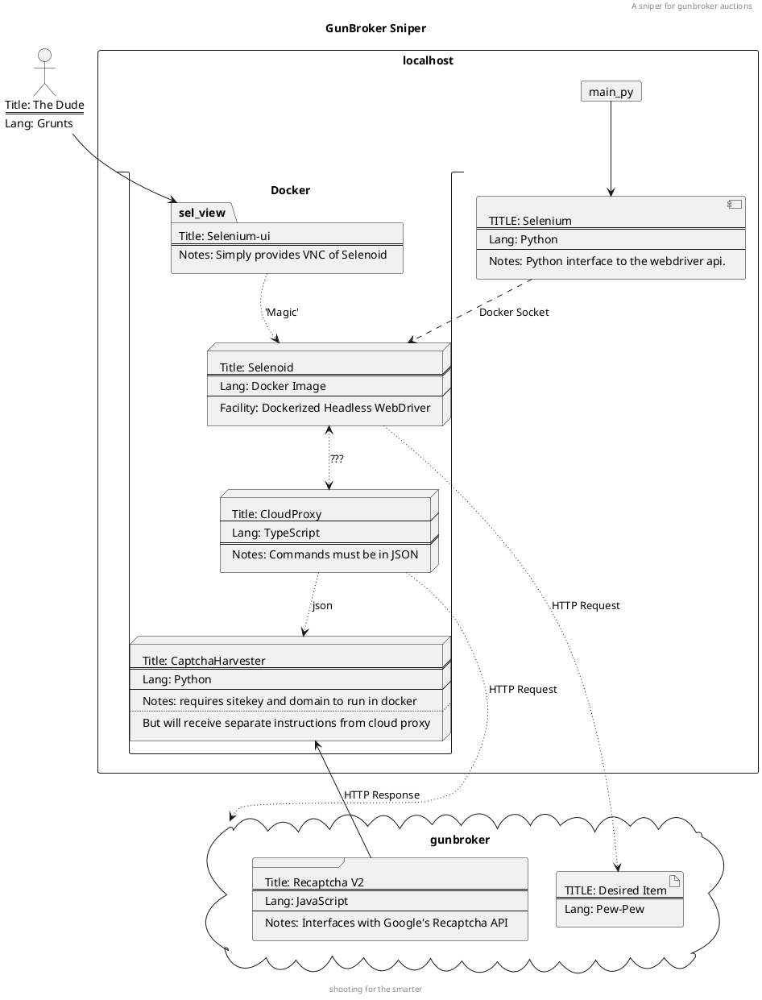

```text
 ██████╗ ██╗   ██╗███╗   ██╗██████╗ ██████╗  ██████╗ ██╗  ██╗███████╗██████╗ 
██╔════╝ ██║   ██║████╗  ██║██╔══██╗██╔══██╗██╔═══██╗██║ ██╔╝██╔════╝██╔══██╗
██║  ███╗██║   ██║██╔██╗ ██║██████╔╝██████╔╝██║   ██║█████╔╝ █████╗  ██████╔╝
██║   ██║██║   ██║██║╚██╗██║██╔══██╗██╔══██╗██║   ██║██╔═██╗ ██╔══╝  ██╔══██╗
╚██████╔╝╚██████╔╝██║ ╚████║██████╔╝██║  ██║╚██████╔╝██║  ██╗███████╗██║  ██║
 ╚═════╝  ╚═════╝ ╚═╝  ╚═══╝╚═════╝ ╚═╝  ╚═╝ ╚═════╝ ╚═╝  ╚═╝╚══════╝╚═╝  ╚═╝
  /$$$$$$            /$$                              
 /$$__  $$          |__/                              
| $$  \__/ /$$$$$$$  /$$  /$$$$$$   /$$$$$$   /$$$$$$ 
|  $$$$$$ | $$__  $$| $$ /$$__  $$ /$$__  $$ /$$__  $$
 \____  $$| $$  \ $$| $$| $$  \ $$| $$$$$$$$| $$  \__/
 /$$  \ $$| $$  | $$| $$| $$  | $$| $$_____/| $$      
|  $$$$$$/| $$  | $$| $$| $$$$$$$/|  $$$$$$$| $$      
 \______/ |__/  |__/|__/| $$____/  \_______/|__/      
                        | $$                          
                        | $$                          
                        |__/                                       
```

## gunbroker-sniper
A sniper for gunbroker auctions

### Status: Conceptual Development

Originally intended to be based off of a sniper for EBay, this project has veered far from that course. The reason for
this lies in obstacles present in the modern web that prevent unwanted automation from taking place. Implementations of
cloudflare and ReCaptcha have made the job of surfing and acquiring information in an automated fashion quite difficult to
accomplish. As such, the original sniper is unsuited to accomplish these tasks. 

The original sniper appears to have facilitated both the use of requests and of selenium to setup the snipe. 
This is actually a brilliant strategy, as requests will always complete the transaction before selenium can even load the page.
To simplify the management of the chrome driver, it is planned to incorporate the use of selenoid to make the project as flexible and uniform as one can.

### Setup

In order to setup this application there are several requirements that will be needed. 

* Docker (for selenoid)
* Selenoid
* Python (obviously)

### Credits

Without the work of Noah Cardoza this project would not be possible, and it would behove anyone using this program to help
support him and his work. 

https://github.com/NoahCardoza

### Diagram (Work in progress!)


